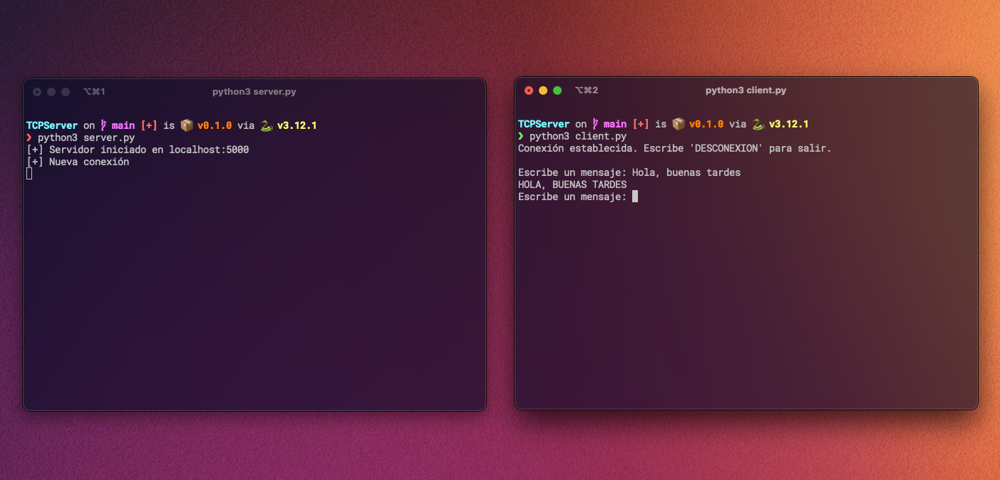
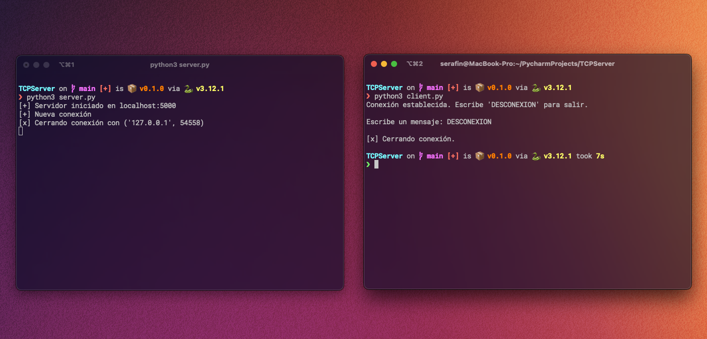

# Servidor y Cliente TCP en Python

Este proyecto contiene una implementación básica de un servidor TCP.

---

## 📦 Requisitos

- Python 3.10 o superior

## 🚀 Ejecución

### 1. Servidor
Para ejecutar el servidor, navega a la carpeta del proyecto y ejecuta el siguiente comando:

```bash
python server.py
```
o

```bash
python3 server.py
```

### 2. Cliente
Para ejecutar el cliente, abre otra terminal y navega a la carpeta del proyecto. Luego ejecuta el siguiente comando:

```bash
python client.py
```
o

```bash
python3 client.py
```

## 🖥️ Interacción

### Conexión y envío de mensaje

### Desconexión

